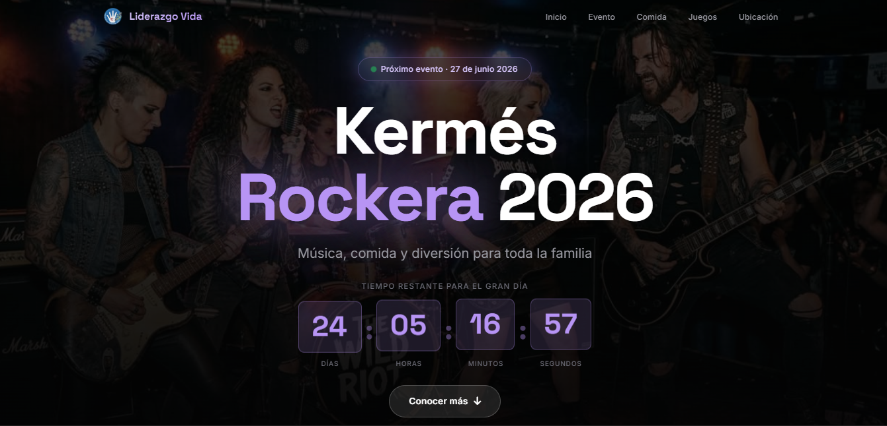

# 🎸 Kermés Rockera 2026

<p align="center">
  
</p>

<p align="center">
  Landing Page oficial de la <strong>Kermés Rockera 2026</strong> organizada por la Fundación Avanza Amor y Liderazgo Vida.
</p>

<p align="center">
  <a href="https://kermes-six.vercel.app/" target="_blank">
    
  </a>
</p>

---

## 📖 Descripción

Kermés Rockera 2026 es una landing page diseñada para promocionar un evento con temática rockera organizado por la Fundación Avanza Amor y Liderazgo Vida.

El sitio proporciona información clara y atractiva sobre el evento, permitiendo a los visitantes conocer los detalles principales y acceder rápidamente a las redes sociales de la fundación.

---

## ✨ Características

- 🎸 Diseño con temática rockera.
- 📱 Totalmente responsivo.
- ⚡ Carga rápida y optimizada.
- 🎨 Interfaz moderna y atractiva.
- 📍 Información clara del evento.
- 🔗 Integración con redes sociales.
- 🏢 Presentación de la fundación organizadora.

---

## 🛠️ Tecnologías Utilizadas

- HTML5
- CSS3
- JavaScript
- Vercel

---

## 📂 Estructura del Proyecto

```text
kermes-rockera/
│
├── index.html
├── README.md
│
├── assets/
│   ├── screenshot.png
│   ├── lg.png
│   └── ...
│
├── css/
│   └── styles.css
│
└── js/
    └── script.js
```

---

## 🚀 Demo

🌐 Sitio desplegado:

https://kermes-six.vercel.app/

---

## 📱 Compatibilidad

El sitio ha sido diseñado para funcionar correctamente en:

- Google Chrome
- Microsoft Edge
- Mozilla Firefox
- Safari
- Android
- iOS

---

## 🎯 Objetivo

Promover la Kermés Rockera 2026 mediante una experiencia web moderna, accesible y atractiva para todos los asistentes.

---

## 🏢 Organización

Evento realizado por:

**Fundación Avanza Amor y Liderazgo Vida**

Su misión es impulsar actividades sociales, recreativas y comunitarias que fortalezcan el desarrollo y bienestar de las personas.

---

## 👨‍💻 Autor

**Ezequiel Salazar**

Estudiante de Ingeniería en Sistemas y desarrollador de software enfocado en crear soluciones tecnológicas útiles y accesibles.

---

## 📄 Licencia

Este proyecto fue desarrollado con fines informativos y promocionales para la Kermés Rockera 2026.

© 2026 Todos los derechos reservados.